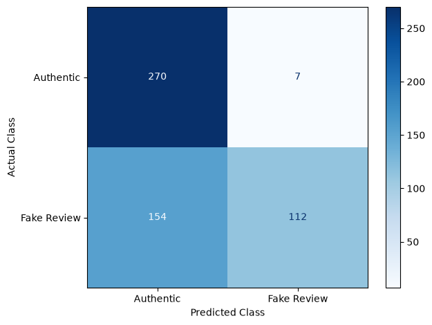
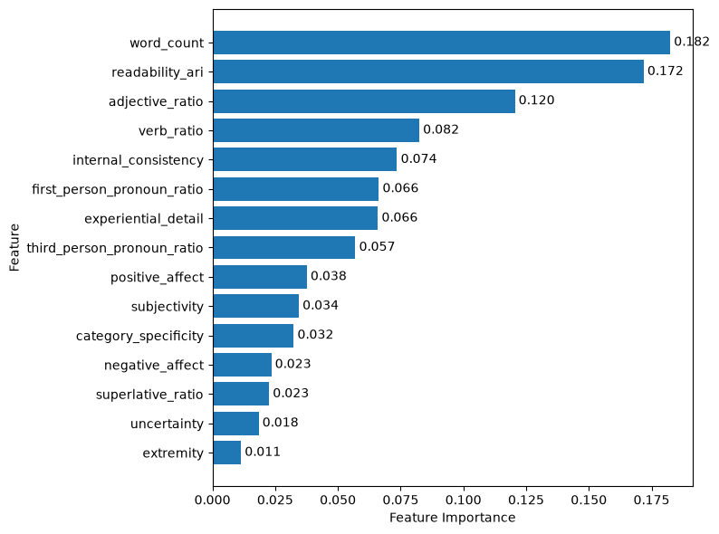
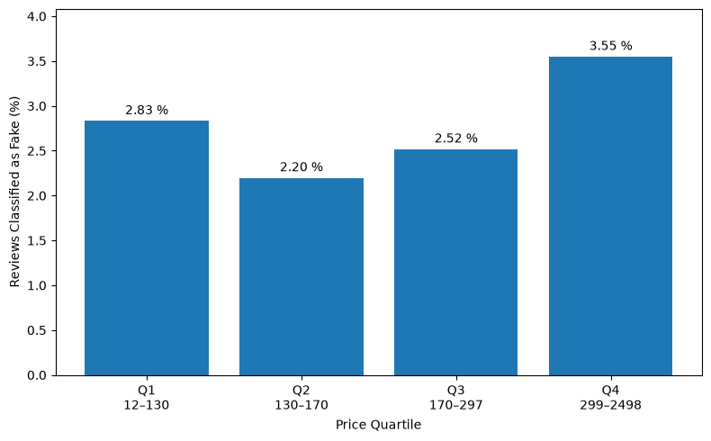

# Fake Reviews on Online Platforms

Empirical part of the bachelor's thesis **"Fake Reviews auf Online-Plattformen: Eine empirische Untersuchung am Beispiel der Produktkategorie PC-Monitore"** (Fake Reviews on Online Platforms: An Empirical Study Using the Product Category of PC Monitors).

## Abstract

> This thesis examines the identification and characterisation of potential fake reviews using the example of PC monitors. Building on a literature review, linguistic, content-related and rating-related detection features are derived and operationalised for the empirical study. Selected content-related features are captured using a large language model. On a labelled dataset containing authentic and computer-generated reviews, logistic regression and a random forest are compared as classification methods. The random forest achieves the better classification performance, reaching a precision of 0.9412 and a recall of 0.4211 on the test set at the chosen decision threshold.
>
> The model is then applied to a random sample of 5,000 PC monitor reviews. 137 reviews (2.74 % of the sample) are classified as potential fake reviews. The classifications show differences across several linguistic and content-related features. Among the additionally examined product and rating characteristics, differences are most notable for product price and verified-purchase status. For the remaining characteristics, no clear relationships can be observed. Since the classification model was trained on computer-generated reviews, the identified reviews should be read as model-based assessments, not as evidence of actual manipulation.

_Translated from the German original; the authoritative wording is that of the thesis._

## Objective

This project examines whether fake product reviews can be distinguished from authentic ones based on linguistic and content-related features. A model trained on labelled data is then applied to an unlabelled sample of real Amazon reviews for PC monitors to estimate the share of suspicious reviews and describe how it relates to product and review characteristics (price, popularity, verified purchase, helpful votes, rating deviation).

The object of study is fake reviews in general, but the labelled dataset **operationalises the construct through computer-generated reviews** (`CG`), since these are the only fake reviews available with reliable labels. The scope of this operationalisation is discussed under [Notes and limitations](#notes-and-limitations).

The feature approach is two-tiered:

1. **Deterministic text features** (spaCy, readability index, part-of-speech ratios)
2. **LLM-based annotation** of content properties (claim counts, sentiment) via a locally run language model

The LLM does **not** classify whether a review is fake. It only annotates linguistic properties of the text; classification is handled by a separate, supervised model.

## Data

| Dataset                                                                 | Source                                                        | Use                                        |
| ----------------------------------------------------------------------- | ------------------------------------------------------------- | ------------------------------------------ |
| [`Flowerly/modern-fake-reviews`](https://huggingface.co/datasets/Flowerly/modern-fake-reviews) (Hugging Face), category `Electronics_5` | Labelled: `OR` = authentic (0), `CG` = computer-generated (1) | Training, validation, test (3,986 reviews) |
| [Amazon Reviews 2023](https://amazon-reviews-2023.github.io/), `meta_Electronics.jsonl` + `Electronics.jsonl`     | Unlabelled real-world data                                    | Sample of 5,000 PC monitor reviews         |

Split of the labelled dataset (splits taken from the source):

| Split      | authentic (0) | fake (1) |
| ---------- | ------------- | -------- |
| train      | 1,600         | 1,601    |
| validation | 116           | 126      |
| test       | 277           | 266      |

For the sample, all products carrying both `Computers & Accessories` and `Monitors` in their categories are filtered from the metadata; an exclusion list of title terms (e.g. `raspberry pi`, `car monitor`, `temperature`) removes false matches. All reviews for these products are then extracted (332,815), and a random sample of 5,000 reviews is drawn (`random_state=7`). The natural distribution is preserved: the sample is neither balanced by star rating nor capped per product.

Raw data is **not** part of the repository (see the `.gitignore` files in `data/download` and `data/input`); the derived feature files under `data/output` are versioned.

## Project structure

```
notebooks/
  01_preparation.ipynb            Data acquisition, filtering, sampling
  02_prepare_feature_data.ipynb   Deterministic features (spaCy, ARI, extremity)
  03_llm_feature_extraction.ipynb LLM annotation via Ollama (qwen3:14B)
  04_merge_data.ipynb             Merging, normalisation, ratio construction
  05_train_and_evaluate.ipynb     Training, evaluation, application to PC monitors
src/
  constants.py                    Paths, column names, feature definitions
data/
  download/                       Raw files (JSONL, not versioned)
  input/                          electronics_raw.csv, sample_raw.csv (not versioned)
  temp/                           Intermediate results (not versioned)
  output/train/                   basic_features.csv, llm_features.csv, final.csv
  output/sample/                  the same files for the PC monitor sample
```

## Pipeline

The notebooks build on one another and are executed in numerical order.

**01: Preparation.** Loads the labelled dataset from Hugging Face, filters it to `Electronics_5` and maps the labels to 0/1 → `data/input/electronics_raw.csv`. In parallel, PC monitors are identified in the raw Amazon data, their reviews are extracted, and the sample is drawn → `data/input/sample_raw.csv`.

**02: Deterministic features.** Computes, per review, word count, verbs, adjectives, superlatives and first- and third-person pronouns using spaCy (`en_core_web_sm`). Also computes the Automated Readability Index (ARI) and `extremity` (1 for a 1- or 5-star rating) → `basic_features.csv`.

**03: LLM features.** Annotates each review with a locally hosted `qwen3:14B` via [Ollama](https://ollama.com), using `temperature=0` and schema-constrained JSON output (Pydantic). Counted are subjective, objective, experiential, positive- and negative-affect, uncertain and category-specific claims; text sentiment is also rated on a scale from −2 to +2 → `llm_features.csv`.

**04: Merging.** Joins both feature sets on `id` (`validate="one_to_one"`; a mismatch raises an error) and derives the model features:

- Part-of-speech counts are divided by word count (ratios).
- Claim counts are normalised by the total number of claims (subjective + objective) and clipped to [0, 1]; with zero claims, `subjectivity` is set to 0.5 and the remaining shares to 0.
- `internal_consistency` measures the agreement between the LLM-rated text sentiment and the star rating.

→ `final.csv` (training data with `label`/`split`, sample with product metadata).

**05: Training and evaluation.** Compares logistic regression (with `StandardScaler`) and random forest via 5-fold stratified cross-validation on the training split. The random forest (500 trees, `max_features="sqrt"`, `min_samples_leaf=2`) is checked on the validation split for two decision thresholds (0.5 vs. 0.8) and then evaluated on the test split at the chosen threshold of **0.8** (accuracy, precision, recall, F1, ROC-AUC, confusion matrix). The high threshold prioritises precision because, when extrapolating to real-world data, false positives are more costly than missed cases.

The model is then applied to the 5,000 PC monitor reviews. The analysis covers feature importances, the share of reviews classified as fake, and how that share is distributed across price quartiles, popularity quartiles (number of product ratings), verified purchases, helpful votes, and the deviation of the individual rating from the product average.

## Model features

15 features, defined in `src/constants.py` as `MODEL_FEATURE_COLUMNS`:

| Feature                      | Source        | Description                                             |
| ---------------------------- | ------------- | ------------------------------------------------------- |
| `readability_ari`            | deterministic | Automated Readability Index                             |
| `extremity`                  | deterministic | 1 for a 1- or 5-star rating                             |
| `word_count`                 | spaCy         | Token count excluding punctuation/whitespace            |
| `adjective_ratio`            | spaCy         | Adjectives per word                                     |
| `verb_ratio`                 | spaCy         | Verbs and auxiliaries per word                          |
| `superlative_ratio`          | spaCy         | Superlatives (`JJS`, `RBS`) per word                    |
| `first_person_pronoun_ratio` | spaCy         | First-person pronouns per word                          |
| `third_person_pronoun_ratio` | spaCy         | Third-person pronouns per word                          |
| `subjectivity`               | LLM           | Share of subjective claims among all claims             |
| `experiential_detail`        | LLM           | Share of claims containing a concrete first-hand detail |
| `positive_affect`            | LLM           | Share of claims with positive affect                    |
| `negative_affect`            | LLM           | Share of claims with negative affect                    |
| `uncertainty`                | LLM           | Share of explicitly uncertain claims                    |
| `category_specificity`       | LLM           | Share of category-specific claims                       |
| `internal_consistency`       | derived       | Agreement between text sentiment and star rating        |

## Results

The values below are those of the stored run of notebook `05` and are subject to the platform caveat described under [Reproducibility across platforms](#reproducibility-across-platforms).

**Model comparison** (5-fold stratified cross-validation on the training split):

| Model | Accuracy | Precision | Recall | F1 | ROC-AUC |
| --- | --- | --- | --- | --- | --- |
| Logistic regression | 0.7598 | 0.7490 | 0.7820 | 0.7649 | 0.8260 |
| Random forest | 0.8122 | 0.8053 | 0.8239 | 0.8144 | 0.9010 |

The random forest outperforms logistic regression on every metric and is used going forward.

**Threshold selection** (random forest on the validation split, ROC-AUC 0.9072):

| Threshold | Accuracy | Precision | Recall | F1 |
| --- | --- | --- | --- | --- |
| 0.5 | 0.8347 | 0.8258 | 0.8651 | 0.8450 |
| 0.8 | 0.6612 | 0.9583 | 0.3651 | 0.5287 |

**Test split** at the chosen threshold of 0.8:

| Accuracy | Precision | Recall | F1 | ROC-AUC |
| --- | --- | --- | --- | --- |
| 0.7035 | 0.9412 | 0.4211 | 0.5818 | 0.8896 |

As expected, the 0.8 threshold sacrifices recall for precision: the model catches less than half of the fake reviews, but 94 % of the ones it does flag are correct. Out of 543 test reviews, 119 are flagged as fake, 112 of those correctly (7 false positives); 154 fake reviews go undetected:



**Feature importances** of the fitted random forest:



Review length (`word_count`, 0.182) and readability (`readability_ari`, 0.172) are the most important features, followed by the adjective ratio (0.120). The eight deterministic and spaCy-based features together make up about 0.71 of the total importance, the seven LLM-based features about 0.29. Among the LLM features, `internal_consistency` (0.074) and `experiential_detail` (0.066) contribute the most.

**Application to PC monitors.** Of the 5,000 sampled reviews, **137 (2.74 %)** are classified as fake at the 0.8 threshold. Comparison of the most important model features between the two groups:

| Feature | Not classified as fake (mean) | Not classified as fake (median) | Classified as fake (mean) | Classified as fake (median) |
| --- | --- | --- | --- | --- |
| `word_count` | 68.081 | 36.000 | 57.533 | 49.000 |
| `readability_ari` | 4.985 | 4.535 | 7.006 | 6.583 |
| `internal_consistency` | 0.833 | 0.750 | 0.967 | 1.000 |
| `experiential_detail` | 0.142 | 0.000 | 0.264 | 0.286 |
| `adjective_ratio` | 0.120 | 0.092 | 0.132 | 0.119 |

> **Note:** Table 4 of the submitted thesis lists the two mean values of each row in the opposite groups; the medians are unaffected, as are all other tables and figures. The values given here are the corrected ones.

Reviews classified as fake have higher mean and median values for readability index, internal consistency, experiential detail and adjective ratio. Word count is the exception: flagged reviews have a higher median (49 vs. 36) but a lower mean (57.5 vs. 68.1), likely because a few very long reviews in the unflagged group pull its mean up.

Descriptive comparison of product and rating characteristics that were not part of the model:

| Characteristic | Not classified as fake (n = 4,863) | Classified as fake (n = 137) |
| --- | --- | --- |
| Product price (median) | 169.99 | 209.79 |
| Verified purchases | 90.4 % | 83.9 % |
| At least one helpful vote | 31.9 % | 29.2 % |
| Product popularity (median number of ratings) | 1,108 | 728 |
| Average product rating | 4.35 | 4.34 |
| Deviation from product average (median) | 0.40 | 0.30 |



Across price quartiles the flagged share ranges from 2.20 % (Q2) to 3.55 % (Q4, the most expensive products); across popularity quartiles from 2.16 % to 3.37 %, with no monotonic trend. The price quartiles cover only the 3,067 reviews whose product has a price in the metadata. Because the absolute number of flagged reviews is low, these subgroup differences rest on small counts and should be interpreted cautiously.

## Setup

Requirements: Python 3.14.2, [Ollama](https://ollama.com) with the model `qwen3:14B` (needed for notebook 03 only).

```bash
python -m venv .venv
.venv\Scripts\activate          # Windows; on macOS/Linux: source .venv/bin/activate
```

Each notebook also installs its own dependencies via a `%pip install` cell at the top.

So that `from src.constants import ...` works inside the notebooks, `.vscode/settings.json` sets `jupyter.notebookFileRoot` to the workspace root. When running outside VS Code, the kernel must be started from the project root.

## Reproduction

1. Place the raw Amazon files (`meta_Electronics.jsonl`, `Electronics.jsonl` from [Amazon Reviews 2023](https://amazon-reviews-2023.github.io/)) in `data/download/`.
2. Run notebooks `01` through `05` in order.

Notebooks `02` to `05` can partly be followed using the versioned files under `data/output/` without the raw data; `05` only needs `data/output/train/final.csv` and `data/output/sample/final.csv` and is therefore runnable on its own.

Random steps use fixed seeds (sampling `random_state=7`, models and cross-validation `random_state=42`; LLM at `temperature=0`).

### Reproducibility across platforms

All random-dependent steps of model training use a fixed `random_state=42`. Repeated training of the random forest within the same environment therefore yields reproducible results.

Across platforms, however, this guarantee does not hold in full. Even with identical input data, an identical Python version and identical versions of the core packages, model results can differ slightly between macOS on Apple Silicon (ARM64) and Windows on Intel/x86-64. The following versions were used on both platforms:

| Component | Version |
| --- | --- |
| Python | 3.14.2 |
| NumPy | 2.5.1 |
| SciPy | 1.18.0 |
| scikit-learn | 1.9.0 |

The platforms rely on different numerical backends and build toolchains (Apple Accelerate compiled with Clang on macOS ARM64 vs. the Windows/x86-64 build compiled with MSVC). These differences in floating-point computation can cause slightly different results in machine learning procedures even with a fixed random seed. A fixed `random_state` therefore ensures reproducibility within one environment, but does not guarantee bit-for-bit identical results across hardware architectures and numerical backends.

The final model metrics reported in the thesis were therefore produced in a defined reference environment:

- macOS ARM64 (Apple Silicon)
- Python 3.14.2, NumPy 2.5.1, SciPy 1.18.0, scikit-learn 1.9.0
- `random_state=42`

## Notes and limitations

- **Domain shift:** Training uses labelled reviews from the _Electronics_ category, while the application targets PC monitors. The test metrics hold for the training domain and do not transfer directly to the sample.
- **No ground truth in the sample:** The PC monitor reviews are unlabelled. "Classified as fake" is a model prediction, not a confirmed property of the review. The reported shares should be read as estimates that carry the model's error profile.
- **Operationalisation:** The construct under study is fake reviews in general, but the labels operationalise it as computer-generated text (`CG`). The model therefore learns the characteristics of generated reviews. Whether the results transfer to other forms of fake reviews, especially manually written but paid ones, is an assumption that the data cannot verify.

## How to cite

**Author:** Malik Sharkawy, Martin-Luther-Universität Halle-Wittenberg

If you refer to this work, please cite the thesis (APA 7th):

> Sharkawy, M. (2026). _Fake Reviews auf Online-Plattformen: Eine empirische Untersuchung am Beispiel der Produktkategorie PC-Monitore_ [Unveröffentlichte Bachelorarbeit]. Martin-Luther-Universität Halle-Wittenberg.

For the code and derived data, cite the repository:

> Sharkawy, M. (2026). _fake-review-detection_ [Computersoftware]. GitHub. https://github.com/malik-shr/fake-review-detection

## References

Bibliography of the thesis. The two data sources used in this repository are Flowerly (n.d.) and Hou et al. (2024).

Abdulqader, M., Namoun, A. & Alsaawy, Y. (2022). Fake Online Reviews: A Unified Detection Model Using Deception Theories. _IEEE Access_, 10, 128622–128655. https://doi.org/10.1109/ACCESS.2022.3227631

Abedin, E., Mendoza, A. & Karunasekera, S. (2022). Are Online Consumer Reviews Credible? A Predictive Model based on Deep Learning. _ACIS 2022 Proceedings_. https://aisel.aisnet.org/acis2022/40

AlSagri, H. & Ykhlef, M. (2020). Quantifying Feature Importance for Detecting Depression using Random Forest. _International Journal of Advanced Computer Science and Applications_, 11(5). https://doi.org/10.14569/IJACSA.2020.0110577

Flowerly. (o. J.). _Modern Fake Reviews_. Hugging Face. https://huggingface.co/datasets/Flowerly/modern-fake-reviews. Aufgerufen am 27.07.2026

Fröhnel, K., Adams, G. B. T. & Zarnekow, R. (2024). Facing the Multifaceted Impact of Fake Reviews: A Comprehensive Literature Review. _Wirtschaftsinformatik 2024 Proceedings_. https://aisel.aisnet.org/wi2024/39

Goutte, C. & Gaussier, E. (2005). A Probabilistic Interpretation of Precision, Recall and F-Score, with Implication for Evaluation. In (S. 345–359). Springer, Berlin, Heidelberg. https://doi.org/10.1007/978-3-540-31865-1_25

Hou, Y., Li, J., Fu, X., He, Z., Yan, A., Chen, X. & McAuley, J. (2024). _Bridging Language and Items for Retrieval and Recommendation: Benchmarking LLMs as Semantic Encoders_. https://arxiv.org/pdf/2403.03952

James, G., Witten, D., Hastie, T., Tibshirani, R. & Taylor, J. E. (2023). _An introduction to statistical learning: With applications in Python_. Springer texts in statistics. Springer International Publishing. https://doi.org/10.1007/978-3-031-38747-0

Kincaid, J. P. & Delionbach, L. J. (1973). Validation of the Automated Readability Index: A Follow-Up. _Human Factors: The Journal of the Human Factors and Ergonomics Society_, 15(1), 17–20. https://doi.org/10.1177/001872087301500103

Le, T.-K.-H., Li, Y.-Z. & Li, S.-T. (2022). Do Reviewers' Words and Behaviors Help Detect Fake Online Reviews and Spammers? Evidence From a Hierarchical Model. _IEEE Access_, 10, 42181–42197. https://doi.org/10.1109/ACCESS.2022.3167511

Maurya, S. K., Singh, D. & Maurya, A. K. (2023). Deceptive opinion spam detection approaches: a literature survey. _Applied Intelligence_, 53(2), 2189–2234. https://doi.org/10.1007/s10489-022-03427-1

Theuerkauf, R. & Peters, R. (2023a). Detecting Fake Reviews: Just a Matter of Data. In T. Bui (Hrsg.), _Proceedings of the Annual Hawaii International Conference on System Sciences_, Proceedings of the 56th Hawaii International Conference on System Sciences. Hawaii International Conference on System Sciences. https://doi.org/10.24251/HICSS.2023.534

Theuerkauf, R. & Peters, R. (2023b). Fake Review Detection – The Value of Domain-Specificity. _AMCIS 2023 Proceedings_. https://aisel.aisnet.org/amcis2023/social_comput/social_comput/2

Victor, V., James, N. & Dominic, E. (2024). Incentivised dishonesty: Moral frameworks underlying fake online reviews. _International Journal of Consumer Studies_, 48(2), Artikel e13037. https://doi.org/10.1111/ijcs.13037

Wu, Y., Ngai, E. W., Wu, P. & Wu, C. (2020). Fake online reviews: Literature review, synthesis, and directions for future research. _Decision Support Systems_, 132, 113280. https://doi.org/10.1016/j.dss.2020.113280
